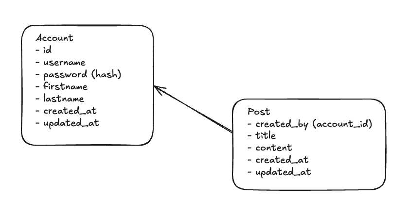

# Social

A speed run application for Go language API

## Requirement

!!require Go

- Go
- sqlboiler
- golang-migrate
- (postgres server)
  - If don't have but your own. Can deploy docker on `deployment/postgres`.
  - require **docker**
  - run `make infra-up`

If you’ve never used SQLBoiler, download the code-gen binaries:

```
$ go install github.com/volatiletech/sqlboiler/v4@latest
$ go install github.com/volatiletech/sqlboiler/v4/drivers/sqlboiler-psql@latest
```

If you’ve never used golang-migrate

```
$ go install -tags 'postgres' github.com/golang-migrate/migrate/v4/cmd/migrate@latest
```

## Structure



A simple structure for my social app. Have only Account table and Post table for this application

## How to run

Require `make` if necessary.

- `make run` run the project
- `make test` run test

- `make infra-up` start the postgres server if don't have it own postgres server

if continue implement

- `make migrate-up` for migrate the data
- (need if update database structure) `make gensqlboiler` gen boiler for the project

### !! Require

Setup environment `.env` and `sqlboiler.toml`. You can look up on `.example` suffix file.

## API Doc

- Login

  URL: `/login`  
  Method: POST  
  Description: Authenticates a user and returns a user ID if successful.

Request Body:

```
{
"username": "string",
"password": "string"
}
```

Response:

```
{
"userId": "string"
}
```

- Register

  URL: `/register`  
  Method: POST  
  Description: Registers a new user.

Request Body:

```
{
  "username": "string",
  "password": "string",
  "firstname": "string",
  "lastname": "string"
}
```

Response:`Empty`

- Create Post

  URL: `/post.create`  
  Method: POST  
  Description: Creates a new post. Requires Basic Authentication.

Request Body:

```
{
  "title": "string",
  "content": "string"
}
```

Response: `Empty`

- List Posts

  URL: `/post.list`  
  Method: POST  
  Description: Lists all posts. Requires Basic Authentication.

Request Body: `Empty`

Response:

```
{
"posts": [
    {
    "id": "string",
    "title": "string",
    "content": "string"
    }
  ]
}
```

- Get Post

  URL: `/post.get`  
  Method: POST  
  Description: Retrieves a post by ID. Requires Basic Authentication.

Request Body:

```
{
  "id": "string"
}
```

Response:

```
{
  "post": {
  "id": "string",
  "title": "string",
  "content": "string"
  }
}
```

- Edit Post

  URL: `/post.edit`  
  Method: POST  
  Description: Edits a post by ID. Requires Basic Authentication.

Request Body:

```
{
  "id": "string",
  "title": "string",
  "content": "string"
}
```

Response: `Empty`

- Delete Post

  URL: /post.delete  
  Method: POST  
  Description: Deletes a post by ID. Requires Basic Authentication.

Request Body:

```
{
  "id": "string"
}
```

Response: `Empty`
